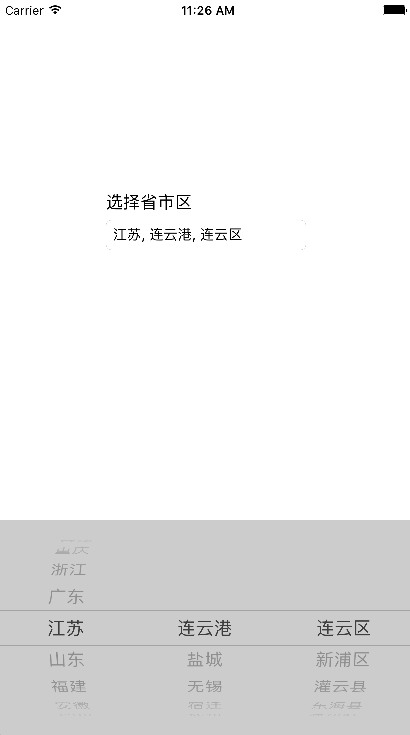

# CZAreaPickerView
一个省市区联动的地址选择器。




## Requirements

iOS8.0+


## Installation
1. 将"CZAreaPickerView"文件夹添加到项目中
2. #import "CZAreaPickerView.h"


## Usage
It is very simple to use it, you just only need to add two lines of code like below.

```
CZAreaPickerView *areaPickerView = [[CZAreaPickerView alloc] init];
self.areaTextField.inputView = areaPickerView;

```
You also can adjust the appearance of the picker view like that:
```
areaPickerView.font = [UIFont systemFontOfSize:18];
areaPickerView.textColor = [UIColor colorWithWhite:0.1 alpha:1];
areaPickerView.backgroundColor = [UIColor colorWithWhite:0.8 alpha:1];
```
